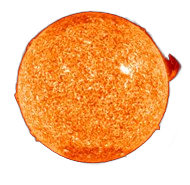
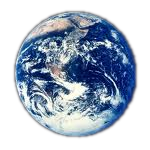
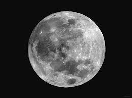
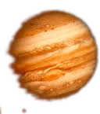
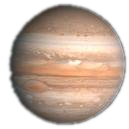

# JS2 - JavaScript Space System
**Ano:** 2009 (ECMA5)

---

## Introdução

JS2 é uma biblioteca para simulação de sistemas espaciais em páginas web, permitindo criar animações de corpos orbitando um centro, com efeitos de profundidade e zoom. Por ter sido desenvolvida em 2009, utiliza recursos da especificação ECMA5.

Toda a lógica está implementada em [`srcs/JS2.js`](srcs/JS2.js).

---

## Como Usar

### 1. Inclusão dos arquivos

No `<head>` do seu HTML, inclua o CSS e o JS:

```html
<link rel="stylesheet" type="text/css" href="css/Space.css" />
<script src="srcs/JS2.js" type="text/javascript"></script>
```
### 2. Estrutura dos elementos

Adicione imagens ou elementos HTML que representarão os corpos celestes, cada um com um id único:

```html





```

### 3. Inicialização do sistema

No JavaScript, obtenha referências aos elementos e inicialize o sistema:

```javascript
var center = document.getElementById("Sol");
var Terra = document.getElementById("Terra");
var Lua = document.getElementById("Lua");
var Marte = document.getElementById("Marte");
var Jupiter = document.getElementById("Jupiter");

// Cria o sistema espacial
var spacesystem = new JS3.spaceSystem(center, screen.width, false, 10);

// Centraliza o objeto principal
var point0 = new JS3.Graphics.point(0, 0, 0);
center.style.left = (point0.convertLT().x - (center.offsetWidth / 2)) + 'px';
center.style.top = (point0.convertLT().y - (center.offsetHeight / 2)) + 'px';
center.style.zIndex = point0.convertLT().z;
```

### 4. Registrando objetos em órbita

Utilize o método registerOrbitalObject para adicionar objetos em órbita ao centro:

```javascript
center.registerOrbitalObject(Terra);
Terra.setRadius(200);
Terra.zx = 0;
Terra.zy = 110;
Terra.s = 50;

Terra.registerOrbitalObject(Lua);
Lua.setRadius(15);
Lua.zx = 0;
Lua.zy = 110;
Lua.s = 150;

center.registerOrbitalObject(Marte);
Marte.setRadius(300);
Marte.zx = 0;
Marte.zy = 110;
Marte.s = 25;

center.registerOrbitalObject(Jupiter);
Jupiter.setRadius(700);
Jupiter.zx = 0;
Jupiter.zy = 110;
Jupiter.s = 10;
```

### 5. Iniciando a animação

Para iniciar a animação, chame:

```javascript
currentSpaceSystem.turnon();
currentSpaceSystem.pause = true; // Para pausar inicialmente
```

## Principais Classes e Métodos

- JS3.spaceSystem: Gerencia o sistema espacial e as órbitas.
- JS3.Graphics.point: Representa um ponto no espaço cartesiano.
- registerOrbitalObject(obj): Adiciona um objeto em órbita.
- setRadius(r): Define o raio da órbita.
- turnon(): Inicia a animação.
- pause: Pausa ou retoma a animação.

## Observações

- Por ser ECMA5, não utiliza recursos modernos como class, let, const ou - arrow functions.
- O sistema depende de elementos HTML posicionados com position: absolute.
- O zoom pode ser controlado via scroll do mouse.
- Para mais detalhes, consulte os comentários no arquivo srcs/JS3.js.

## Exemplo Completo

Veja o exemplo em index.html para uma implementação funcional.